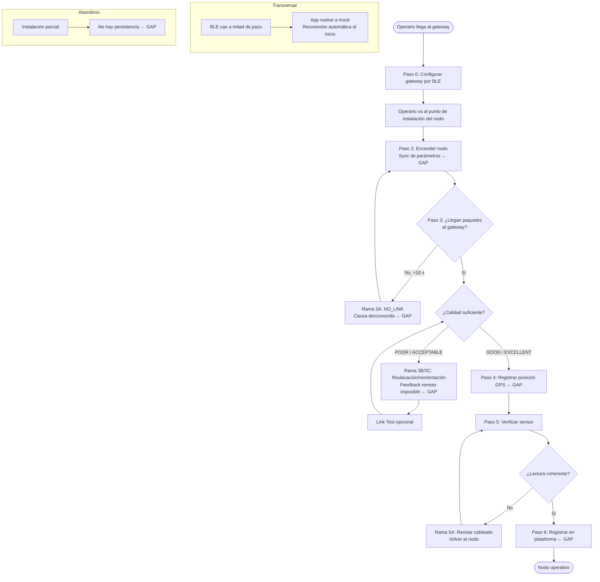

# Análisis de encaje: app de operario ↔ flujo de comisionamiento

---

## 1. Contexto y alcance de la app

La app juega **únicamente en comisionamiento**: instalar un nodo y verificar que su enlace LoRa con el gateway funciona. No es una consola de operación diaria.

**Contexto de protocolo:** el proyecto usa LoRaWAN tanto en PoC como en producción (con ChirpStack como network server, en otro repo). El firmware actual usa raw LoRa como estado de desarrollo inicial. El comisionamiento ocurre en la fase *pre-join*: se verifica el canal RF antes de que el dispositivo sea provisionado en la red LoRaWAN. El despliegue es single-channel en ambos casos (PoC y producción prevista); no se contempla migrar a concentrador multicanal como paso necesario.

**Con quién habla:**
- Se conecta por BLE al `lora-rx` (gateway). Hoy es su único interlocutor.
- El `lora-tx` (nodo) no tiene BLE: la app no puede alcanzarlo.
- El servidor LoRaWAN/ChirpStack queda fuera de su alcance durante el comisionamiento.

**Lo que puede hacer hoy:**
- Escanear y conectarse por BLE al gateway (`lora-rx`)
- Ver métricas de enlace en tiempo real: RSSI, SNR, PDR, gráficos, log de paquetes
- Configurar parámetros de radio en el gateway y confirmar ACK del firmware
- Ejecutar un Link Test con duración fija y resumen final

**Lo que no puede hacer:**
- Alcanzar el nodo (`lora-tx`) por BLE
- Registrar la posición GPS del nodo
- Provisionar credenciales LoRaWAN (DevEUI, JoinEUI, AppKey) ni verificar OTAA join
- Distinguir entre "nodo apagado" y "parámetros de radio no sincronizados"
- Persistir una instalación parcial para retomarla

---

## 2. Flujo de trabajo del operario

### Contexto de cardinalidad (resuelto, no asumido)

El caso de uso dominante es **un solo operario** que instala un nodo en una red existente donde el gateway ya está operativo. Exigir dos personas coordinadas contradice la propuesta de baja fricción.

El análisis distingue tres cosas que no deben confundirse:
- **(i) Comisionamiento normal (1 operario):** instala el nodo, verifica el enlace desde el punto de instalación. El gateway no necesita a nadie durante este proceso si ya está configurado.
- **(ii) Multi-vista (1 operario, 2 momentos distintos):** útil como recurso de diagnóstico o para la puesta a punto inicial del gateway. El operario va primero al gateway, lo configura, luego va al punto del nodo.
- **(iii) Multi-operario simultáneo:** modo avanzado de despliegue de sitio (levantar gateway + varios nodos el mismo día). No es el flujo dominante.

La consecuencia clave para la sincronización de parámetros: **no es necesario estar en el gateway durante la instalación de cada nodo si el gateway ya tiene la config correcta.** La sync es un problema de puesta a punto inicial, no de instalación cotidiana.

---

### Pasos del flujo, ramas y retrocesos

#### Paso 0 — Puesta a punto del gateway (anterior a cada instalación de nodo)
- **(a)** Operario va al gateway, lo enciende.
- **(b)** App escanea BLE → encuentra `LORA-RX-01` → conecta.
- **(c)** BLE → gateway: lee `CHAR_RADIO_CONFIG`; opcionalmente escribe nueva config vía `SET_RADIO_CONFIG`.
- **(d)** App muestra "✓ Aplicado". Operario anota o recuerda los parámetros activos (freq/SF/BW/CR).
- **Etiqueta:** Común. El despliegue es single-channel en PoC y en producción prevista: la sincronización de canal/SF siempre es necesaria.
- **Nota:** Este paso se hace una vez por red o cuando se cambia la config global. No se repite para cada nodo.

#### Paso 1 — Llegada al punto de instalación del nodo
- **(a)** Operario llega al sitio con el nodo (`lora-tx`) apagado.
- **(b/c)** App no hace nada todavía; sigue conectada al gateway si el operario no se desconectó (pero fuera de alcance BLE del gateway, la conexión BLE cae sola).
- **(d)** No hay feedback necesario.
- **Etiqueta:** Común.

#### Paso 2 — Configuración del nodo (sync de parámetros)
- **(a)** Operario enciende el nodo. Fija/orienta la antena provisoriamente.
- **(b/c)** **Aquí está el gap central:** la app hoy no puede conectarse al nodo por BLE. El nodo `lora-tx` no tiene BLE. El operario debe asegurarse de que el nodo tiene los mismos parámetros que el gateway por algún mecanismo externo (firmware preconfigurado de fábrica, o un segundo operario en el gateway).
- **(d)** Sin feedback de la app. El operario confía en que el nodo está bien configurado.
- **Etiqueta:** Común. En despliegue single-channel (PoC y producción prevista), la sync de freq/SF/BW/CR es siempre crítica: si no coinciden, el enlace no existe. No hay concentrador multicanal que absorba la diferencia.
- **Decisión arquitectónica:** ver sección 4.

#### Paso 3 — Verificación del enlace (camino feliz)
- **(a)** Operario va hacia el gateway (o usa un segundo teléfono/operario allí). Conecta la app al gateway por BLE. Espera paquetes.
- **(b)** App muestra RSSI, SNR, PDR en tiempo real en la tab Monitor.
- **(c)** BLE → gateway: notificaciones `CHAR_PACKET_RX`.
- **(d)** App muestra badge EXCELLENT/GOOD/ACCEPTABLE/POOR. Operario decide si el enlace es aceptable.
- **Etiqueta:** PoC y campo.

> **Rama 3A — Enlace no se establece (nodo no llega al gateway):**
> - Condición: después de 10 s sin paquetes, app muestra NO_LINK.
> - Operario no sabe si es: (a) parámetros de radio distintos, (b) nodo apagado/roto, (c) distancia/obstrucción, (d) antena del nodo mal orientada.
> - **Gap:** la app no distingue estas causas. El operario queda sin pista de diagnóstico.
> - Operario vuelve al nodo (Paso 2) para verificar que esté encendido y configurado.

> **Rama 3B — Enlace débil (POOR o ACCEPTABLE):**
> - Condición: el badge muestra calidad insuficiente.
> - **(a)** Operario debe reubicar, elevar o reorientar la antena del nodo → vuelve al punto de instalación.
> - **(b/c)** Mientras el operario está en el nodo, no puede ver la app (que está cerca del gateway).
> - **Gap crítico de UX:** el operario necesita feedback de RSSI/SNR mientras está físicamente en el nodo ajustando la antena. Hoy eso requiere estar al lado del gateway. El refresco de paquetes es cada 2 s (el nodo TX cada 2 s), lo que es usable para orientar una antena solo si el operario puede ver la pantalla en tiempo real. En PoC con yagi esto es un problema real.
> - **Decisión:** la solución no es poner un segundo operario en el gateway; es hacer que el gateway telemetrize su RSSI/SNR recibido de vuelta al teléfono del operario que está en el nodo. Esto requiere que el nodo también tenga BLE (ver sección 4).
> - Después de ajustar, operario vuelve al Paso 3.

> **Rama 3C — Enlace establecido pero intermitente (PDR < 85%):**
> - App muestra POOR, PDR bajo pero RX > 0.
> - Operario ejecuta Link Test (tab Test) para medir con rigor en ventana de tiempo.
> - Si PDR mejora con más tiempo → enlace marginal pero funcional.
> - Si PDR sigue bajo → Rama 3B (reubicación).

#### Paso 4 — Registro de posición del nodo
- **(a)** Operario está en el punto del nodo. Registra posición.
- **(b/c)** **Gap:** la app no tiene pantalla de registro GPS. El operario usa un método externo (foto del lugar, anotación, otra app).
- **(d)** Sin feedback de la app.
- **Etiqueta:** Común. Imprescindible para nodo fijo; ausente para nodo móvil/collar.

#### Paso 5 — Verificación del sensor (dependiente del tipo de nodo)
- **(a)** Operario verifica que los datos del sensor son coherentes con la realidad física del sitio.
- **(b)** App muestra temp/hum/bat en el log de paquetes.
- **(c)** Datos vienen en `CHAR_PACKET_RX`.
- **(d)** Operario ve los valores y los compara contra su referencia. Para nodo binario/contacto la verificación es trivial. Para nodo meteo/nivel requiere una referencia (termómetro de mano, nivel de agua visible). Para nodo con calibración inicial (T) requeriría un paso extra no contemplado.
- **Etiqueta:** Común (tipo-dependiente en dificultad).

> **Rama 5A — Lectura incoherente del sensor:**
> - Condición: valor fuera de rango esperado (ej. temp = -40°C con ambiente de 25°C).
> - Operario debe revisar el cableado del sensor en el nodo.
> - **Gap:** la app no puede hacer nada para ayudar; el diagnóstico es físico.
> - Operario vuelve al nodo, revisa, y espera que los valores se normalicen en el log.

#### Paso 6 — Registro del nodo en la plataforma / confirmación final
- **(a)** Operario confirma que el nodo queda operativo.
- **(b/c)** **Gap:** la app no tiene pantalla de "registrar nodo" ni de "dar de alta" en ningún sistema. No hay handshake de comisionamiento completado.
- **(d)** Sin feedback de la app sobre este paso.
- **Etiqueta:** Común. El proyecto usa LoRaWAN en PoC y producción; este paso implica provisionar las credenciales (DevEUI, JoinEUI, AppKey) en ChirpStack y confirmar que el nodo completa el OTAA join. Hoy no está cubierto por la app.

#### Paso 7 — Instalación abandonada y retomada
- **(a)** Operario debe irse antes de completar el comisionamiento.
- **(b)** **Gap:** la app no persiste estado de instalación parcial. Al cerrar la app se pierde el contexto (qué nodo se estaba instalando, qué pasos completó, posición provisional, etc.).
- **(d)** Al retomar, el operario empieza desde cero o confía en su memoria.
- **Etiqueta:** Común.

> **Rama transversal — Pérdida de BLE a mitad de un paso:**
> - Condición: el operario se aleja del gateway y la conexión BLE cae.
> - La app detecta la desconexión y vuelve a modo simulado (MockTransport).
> - **Parcial:** la reconexión automática está implementada (intenta reconectar al dispositivo conocido al iniciar).
> - **Gap:** si la caída ocurre durante un Link Test en curso, el test se "congela" (sigue el timer pero sin nuevos paquetes). No hay feedback claro de "BLE perdido durante el test".

---

### Diagrama de flujo

---

## 3. Tabla de encaje

| Paso / Rama | Estado actual | Gap concreto |
|---|---|---|
| P0 · Configurar gateway por BLE | **Cubierto** | Config funciona, ACK del firmware visible |
| P2 · Sync parámetros nodo↔gateway | **Ausente** | El nodo no tiene BLE; la app no puede configurarlo. El operario depende de firmware preconfigurado o coordinación externa |
| P3 · Ver enlace en tiempo real desde el gateway | **Cubierto** | Monitor funciona; RSSI, SNR, PDR, badge de calidad |
| P3 · Latencia de refresco para orientar antena | **Con fricción** | Paquetes cada 2 s: usable si el operario puede ver la pantalla. El problema es que para ver la pantalla tiene que estar en el gateway, no en el nodo |
| 3A · Diagnóstico de NO_LINK | **Ausente** | La app muestra "sin enlace" pero no distingue causa (parámetros distintos / nodo apagado / distancia / antena) |
| 3B · Feedback de RSSI/SNR mientras se ajusta la antena en el nodo | **Ausente** | Requiere feedback remoto desde el gateway hacia el teléfono del operario en el nodo. No existe |
| 3C · Link Test con ventana de tiempo | **Cubierto** | Tab Test completa con resumen PDR, RSSI/SNR mín/máx/prom |
| P4 · Registro de posición GPS del nodo | **Ausente** | No hay pantalla ni función en la app |
| P5 · Ver datos del sensor en el log | **Cubierto** | Log muestra temp/hum/bat por paquete |
| 5A · Lectura incoherente → diagnóstico | **Parcial** | Los valores se ven; la app no los valida contra rangos esperables ni alerta |
| P6 · Registro del nodo en plataforma | **Ausente** | No hay concepto de "nodo registrado" en la app (PoC raw LoRa lo justifica hoy) |
| P7 · Instalación parcial, reanudar | **Ausente** | No hay persistencia de estado de comisionamiento |
| Transversal · Pérdida de BLE | **Parcial** | Reconexión automática al inicio implementada; no hay feedback durante Link Test si BLE cae en medio |
| Transversal · Disclaimer sync manual | **Ausente** | La tab Config no advierte que el nodo debe tener los mismos parámetros |

---

## 4. Cambios propuestos

### IMPRESCINDIBLES

#### C1 — BLE en el nodo (`lora-tx`) + configuración autónoma por app
- **Motiva:** Paso 2, Rama 3A, Rama 3B. Sin esto la app no puede sincronizar parámetros ni confirmar que el nodo está encendido y configurado correctamente.
- **Qué implica:** el firmware `lora-tx` necesita un servidor BLE GATT mínimo (misma arquitectura que `lora-rx`): exponer `CHAR_RADIO_CONFIG` (R/W) y `CHAR_DEVICE_INFO`. La app necesita poder conectarse a un nodo (no solo al gateway) y escribir la config de radio.
- **En la app:** la pantalla de conexión BLE y la tab Config ya están; solo necesitan saber si están hablando con un gateway o con un nodo, y ajustar el label/contexto.
- **Etiqueta:** PoC + campo. **Imprescindible.**

#### C2 — ACK downlink de confirmación: entrega + RSSI/SNR del gateway hacia el nodo
- **Motiva:** Rama 3B. El operario no puede orientar una antena yagi mientras mira el teléfono si tiene que estar en el gateway para verlo.
- **Alcance acotado:** no se trata de replicar la "vista de gateway" en el nodo. Solo se necesita saber, desde el punto del nodo: ¿llegó el último paquete? Y si llegó, ¿con qué RSSI/SNR lo vio el gateway? Eso le da al operario feedback de calidad mientras ajusta la antena.
- **Qué implica:** el gateway, al recibir un paquete del nodo, responde con un paquete raw LoRa mínimo (~5 bytes: `seq_ack + rssi_gw + snr_gw`). El nodo, tras cada TX, abre una ventana RX breve para recibirlo. Si lo recibe, lo expone por BLE como una característica de solo lectura. La app muestra algo como: *"Última entrega: seq 47 · RSSI en gateway: −78 dBm · SNR: 5.2 dB"*. Requiere C1.
- **Nota LoRaWAN:** este mecanismo es válido durante la fase de comisionamiento pre-join, donde se verifica el canal RF antes de provisionar el dispositivo en la red. Opera como raw LoRa bidireccional en esta ventana temporal. En LoRaWAN producción con el stack activo, el gateway no puede enviar raw LoRa arbitrario (es controlado por ChirpStack); en ese contexto, la confirmación de entrega sería via `LinkCheckReq/Ans` del protocolo LoRaWAN, no via este mecanismo. Por eso C2 es infraestructura de comisionamiento, no de operación.
- **Etiqueta:** Comisionamiento pre-join. Crítico para antena yagi con un solo operario. **Imprescindible para PoC.**

#### C3 — Disclaimer de sincronización en la tab Config
- **Motiva:** Paso 2. El operario puede cambiar la config del gateway sin saber que el nodo también tiene que cambiarse.
- **Qué implica:** un texto visible en la tab Config: *"TX Power no requiere sincronización. Frecuencia, SF, BW y CR deben coincidir exactamente entre nodo y gateway. Si cambiás estos parámetros, actualizá también el nodo."*
- **Etiqueta:** Común. **Imprescindible, bajo costo.**

#### C4 — Diagnóstico básico de NO_LINK
- **Motiva:** Rama 3A. Hoy "sin enlace" es un callejón sin salida para el operario.
- **Qué implica:** cuando NO_LINK persiste >30 s, la app muestra una lista de causas probables y acciones: "¿El nodo está encendido? ¿Freq/SF/BW/CR coinciden con el gateway? ¿Hay obstrucción física? ¿Necesitás elevar la antena?" No requiere información nueva; es orientación contextual.
- **Etiqueta:** Común. **Imprescindible.**

---

### DESEABLES

#### C5 — Registro de posición GPS del nodo
- **Motiva:** Paso 4. El operario hoy usa algún método externo.
- **Qué implica:** pantalla simple dentro del flujo de instalación: botón "Registrar posición actual", captura lat/lon del GPS del teléfono, muestra coordenadas y permite agregar una etiqueta (nombre del nodo, número de lote). Persiste localmente o exporta.
- **Etiqueta:** Común. **Deseable.** No es crítico para que el nodo funcione, pero sí para la gestión de la red.

#### C6 — Flujo de comisionamiento guiado (wizard)
- **Motiva:** Paso 7, y la coherencia general del flujo. Hoy la app es una colección de tabs sin orden implícito. Un operario nuevo no sabe por dónde empezar.
- **Qué implica:** una pantalla de inicio de comisionamiento que guíe: "1. Conectá al nodo → 2. Verificá/aplicá config → 3. Esperá el enlace → 4. Ejecutá Link Test → 5. Registrá la posición". Persiste el paso actual para poder reanudar.
- **Etiqueta:** Común. **Deseable.**

#### C7 — Validación de rango de valores del sensor
- **Motiva:** Rama 5A. Hoy los valores se muestran pero no se validan.
- **Qué implica:** alertas visuales si temp/hum/bat están fuera de rango físicamente plausible (ej. temp < -20°C o > 60°C en ambiente exterior templado). Configurable por tipo de nodo.
- **Etiqueta:** Común. **Deseable.**

#### C8 — Feedback de BLE perdido durante Link Test
- **Motiva:** Rama transversal. El test sigue corriendo el timer aunque no lleguen paquetes por pérdida de BLE.
- **Qué implica:** detectar que la fuente de datos pasó a mock durante un test en curso y mostrar "BLE desconectado — test pausado".
- **Etiqueta:** Común. **Deseable.**

---

## 5. Supuestos y preguntas abiertas

### Supuestos declarados (no encontrados en el código ni en el contexto inline)

| # | Supuesto | Por qué se necesita |
|---|---|---|
| S1 | El gateway (`lora-rx`) ya está instalado, elevado y operativo antes de que el operario empiece a instalar nodos | El flujo del Paso 0 solo tiene sentido si el gateway es preexistente |
| S2 | El firmware del nodo `lora-tx` viene preconfigurado de fábrica con la misma config por defecto que el gateway (916.8 MHz, SF7, BW125, CR 4/5) | No hay mecanismo de sync hoy; el flujo solo funciona si coinciden los defaults |
| S3 | En PoC, el operario conoce de antemano qué parámetros tiene el gateway, o los anota en el Paso 0 | Sin BLE en el nodo, la sync es manual |
| S4 | Los nodos móviles/collar (T) no se comisionan con este flujo — su instalación es diferente (no hay posición fija, no hay verificación de enlace estática) | El análisis se focalizó en nodo fijo como caso dominante |
| S5 | El firmware actual usa raw LoRa como estado de desarrollo inicial; el objetivo es LoRaWAN en PoC y producción. El provisioning de credenciales (DevEUI, JoinEUI, AppKey) y el OTAA join quedan fuera del scope actual de la app | La app cubre la verificación del canal RF pre-join; el alta en ChirpStack es un paso externo no mediado por la app hoy |

### Preguntas abiertas

| # | Pregunta | Impacto |
|---|---|---|
| Q1 | ¿Cuántos nodos se instalan en una jornada típica? ¿1-2 o decenas? | Condiciona si el wizard guiado (C6) es imprescindible o deseable. Sin respuesta aún. |
| Q4 | ¿El gateway tiene conectividad con la plataforma (Internet/backhaul) durante el comisionamiento? | Si sí, el Paso 6 podría ser mediado por la app a través del gateway. Si no, el registro en ChirpStack es diferido |
| Q5 | ¿Cuál es el umbral de calidad de enlace aceptable para dar por comisionado un nodo? ¿GOOD es suficiente o se exige EXCELLENT? | Condiciona si el Link Test es un paso obligatorio del flujo o un recurso opcional |
| Q6 | ¿El nodo collar/móvil (T) se comisiona o simplemente se enciende y listo? | Define si la app necesita un flujo alternativo o si ese tipo queda fuera de su scope |

### Resueltas

| # | Pregunta | Respuesta |
|---|---|---|
| Q2 | ¿El operario típico es el productor o un técnico de instalación? | Técnico. La UI debe estar fuertemente condicionada por el flujo de trabajo esperado, no simplificarse por eso. |
| Q3 | ¿La config de radio cambia frecuentemente o se setea una vez? | Se setea una vez. La sync manual del Paso 0 es aceptable como diseño permanente. |
